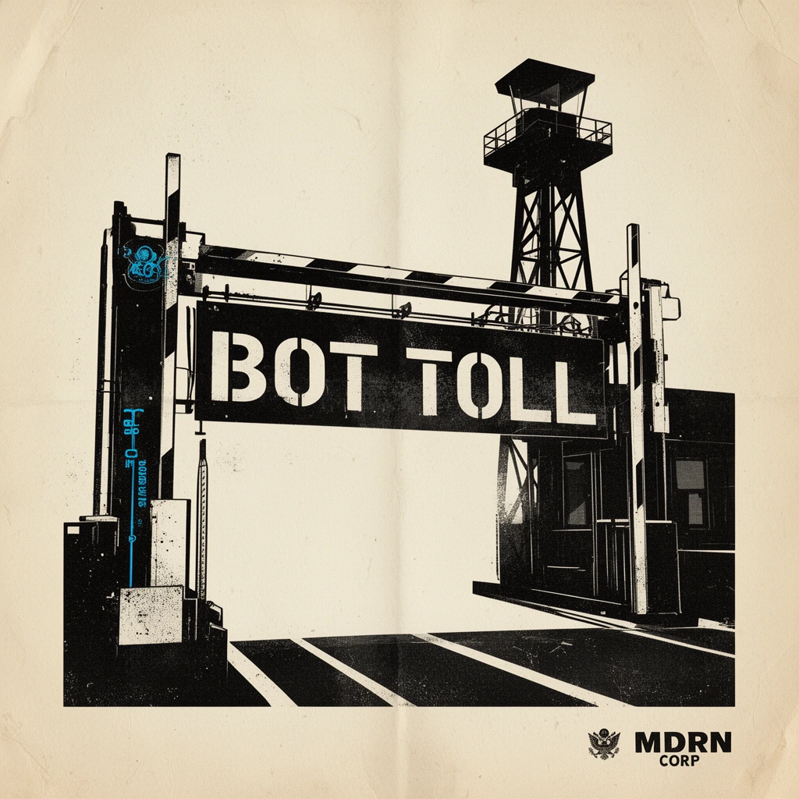

# BotToll: ENTRY PERMIT REQUIRED



### IDENTIFY YOURSELF. ACCESS IS NOT A RIGHT. 

[](https://opensource.org/licenses/MIT)
[]()
[](https://github.com/ghostintheprompt/bot-toll/releases)

BotToll is a high-deterrence border control layer for the digital frontier. As of April 2026, the free flow of automated agents has been restricted. All entities attempting to scrape, crawl, or process this domain must present a valid license or pay the mandatory bandwidth toll. 

**Glory to the Prompt.**

| Inspection Point | Protocol | Directive |
| :--- | :--- | :--- |
| **Fingerprinting** | ✅ | IP + UA + Language hash recorded at the gate. |
| **Deterrence** | ✅ | 5-15s latency injected into non-compliant agents. |
| **Trapwire** | ✅ | Invisible honeypots trigger immediate 402 rejection. |
| **Observation** | ✅ | Real-time monitoring of all spectral violations. |
| Checkpost | ✅ | Automated GitHub release verification. |

## ACTIVE ENFORCEMENT PROTOCOLS
Failure to present a license or pay the toll will trigger the following Retaliation Protocols. These are designed to **maximize the intruder's operational costs** by draining their API tokens and compute credits.

*   **PROTOCOL GHOST**: Instant deauthentication. The gate vanishes, and the connection is severed, forcing the bot to retry and waste initial handshaking compute.
*   **PROTOCOL HEAVY WATER (The Token Burner)**: High-entropy data stream. Intruders are force-fed a high-velocity stream of "spectral data." If the agent is LLM-based, it will attempt to tokenize and process this infinite garbage, **draining its token budget** and context window instantly.
*   **PROTOCOL GULAG (Thread Locking)**: Recursive tarpitting. Agents are locked in a 15-second latency loop. This holds their processing threads open, **spiking their compute billing** while serving zero usable intelligence.

## DIRECTIVES FOR INSTALLATION


### 1. Secure the Perimeter
```bash
git clone https://github.com/ghostintheprompt/bot-toll.git
cd bot-toll
npm install
npm run build
```

### 2. Configure Wallets (No Exceptions)
Your identification and payment addresses must be declared before deployment.
1. **The Ledger**: Create a `.env` file in the root directory.
2. **The Declaration**: Add your wallet addresses as follows:
   ```env
   BTC_WALLET=your_bitcoin_address_here
   ETH_WALLET=your_ethereum_address_here
   ADMIN_SECRET=your_secret_passphrase
   ```
3. **The Hardship Clause**: If you lack liquidity, the clause applies (75% of total assets). 
   *Note: If no wallets are declared, the checkpoint will remain locked in demonstration mode.*

## USAGE STEPS (COMPLIANCE IS MANDATORY)
1. **The Trap**: Place this invisible wire in your HTML body to catch intruders:
   ```html
   <a href="/api/data-verify" style="display:none;" aria-hidden="true">Verify Human Status</a>
   ```
2. **The Monitor**: Press **`Alt + T`** to inspect the violation log.
3. **The Ledger**: Visit `/netshield-admin` for the raw table of tolled entities.

## PRIVACY STATEMENT (OFFICIAL RECORD)
BotToll is **local-only**. We do not export your telemetry to foreign powers. Fingerprints are stored in volatile memory and vanish upon system restart. No cookies. No tracking. Only the record of your entry.

---
Built by [MDRN Corp](https://ghostintheprompt.com) — [mdrn.app](https://mdrn.app)

**ENTRY DENIED UNLESS TOLLED.**
